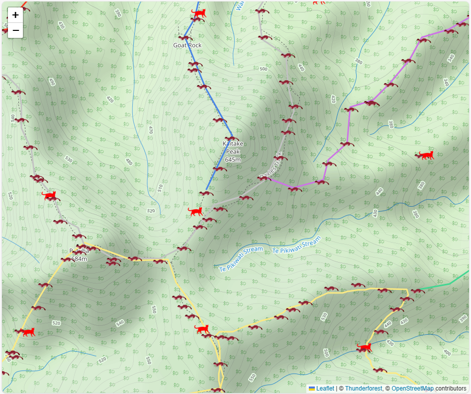

## TrapNZDataHelper.js

This is a data helper in JS that takes geojson from the trap.nz API to display trap lines and trap locations on an openstreetmap (using leaflet)

Demo is here:  
https://trapnzdata.netlify.app/



### How to use

You can view the index.html in this repository for a working example.

* Show the leaflet map as per normal ([leaflet quick start](https://leafletjs.com/examples/quick-start/) or look at the index file in this repository)
* Include TrapNZDataHelper.js on the page (and if you don't ready have it also include jquery - both are in the scripts folder of this repository)

```
<script src="scripts/jquery-3.7.1.min.js"></script>
<script src="scripts/trapNZDataHelper.js"></script>
```
* Copy the 'ICON_Cat.png', 'ICON_Possum.png' etc files from the images directory to your own images directory
* After the above script includes and after your map has been created call the appropriate function(s), passing in a URL to your data ([details on accessing trap.nz data](#accessing-trap-nz-data))
```
// this is using downloaded data from the trap.nz API
// you can use direct from the API if you don't mind exposing your API key in the javascript
//let trapLineJsonUrl = "https://io.trap.nz/geo/trapnz-projects/wfs/[apikey]/[projectkey]?service=WFS&version=1.0.0&request=GetFeature&typeName=default-project-lines&outputFormat=application/json";
//let trapJsonUrl = "https://io.trap.nz/geo/trapnz-projects/wfs/[apikey]/[projectkey]?service=WFS&version=1.0.0&request=GetFeature&typeName=default-project-traps&outputFormat=application/json";
let trapLineJsonUrl = "data/trapline.json";
let trapJsonUrl = "data/traps.json";

trapNZDataHelper.showTrapLines(map, trapLineJsonUrl);
trapNZDataHelper.showTrapIcons(map, trapJsonUrl);
```


### Accessing trap nz data

Rather than directly getting data from the trap.nz API in javascript, which will expose your API key so that others might use or abuse it, you can create a github action to download the data on a schedule. There is action in this repository called 'DownloadTrapNZGeoJson.yml' that does that. For this action to work you need to put your project key and api key as secrets (details here https://help.trap.nz/books/trapnz-comprehensive-user-guide/chapter/map-feeds) in the repository.


